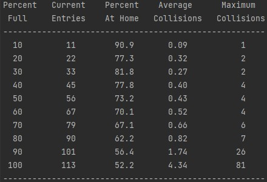

# Hashing Algorithm

This is a second year project where our team was assigned to create the logic for a hashing algorithm. The algorithm converts strings to integers and attempts to insert them into a limited size hash table. If there is already a value at given key then there will be an attempt to insert at the next position in the table until an empty slot has been found or has not. Statistics about the number of collisions, average collisions as the hash table fills up, difference between linear probing and double hashing, and frequency of words added can be seen using CLI arguments.

## How to Run

Compile the files in this root directory and run. An example text file is given which is the novel "war and peace" by Leo Tolstoy.

`gcc *.c -o asgn1`

**linux:**

`./asgn1 < war-peace.txt`

**Powershell:**

`Get-Content war-peace.txt | .\asgn1`

## Command Line arguments

| Option         | Action Performed                                                                                                                                                                |
|----------------|---------------------------------------------------------------------------------------------------------------------------------------------------------------------------------|
| -d             | Uses double hashing as the collision resolution strategy (linear probing is the default)                                                                                        |
| -e             | Displays the entire contents of the hash table on stderr                                                                                                                        |
| -p             | Prints information about the table as it was being created with snapshots displaying statistics at different intervals.                                                         |
| -s *snapshots* | Displays up to the given number of stats when given -p as an argument. If the table is not full then fewer snapshots will be displayed. Snapshots with 0 entries are not shown. |
| -t *tablesize* | Uses the first prime number >= table size as the size of the hash table.                                                                                                        |
| -h             | Prints a help message describing how to use the program.                                                                                                                        |

## Example

Using the command: 

``gcc *.c -o asgn1``

`Get-Content war-peace.txt | .\asgn1`

Produces the result:

Where each line is a snapshot at a given percentage thee hash table has been filled.
(Percent at home is how many keys were placed without a collision occurring).